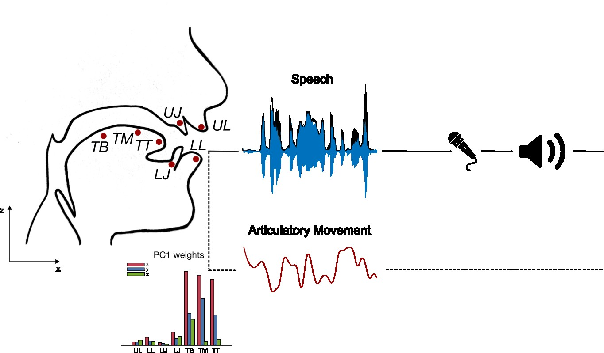

# articEncod_difficulty

The human brain tracks available speech acoustics and simulates missing information such as the speaker’s articulatory patterns. However, the extent to which articulatory reconstruction supports speech perception remains unclear. This study explores the relationship between articulatory reconstruction and task difficulty. Participants listened to sentences and performed a speech-rhyming task. Real kinematic data of the speaker's vocal tract were recorded via electromagnetic articulography (EMA) and aligned to corresponding acoustic outputs. We extracted articulatory synergies from the EMA data using Principal Component Analysis (PCA) and employed Partial Information Decomposition (PID) to separate the electroencephalographic (EEG) encoding of acoustic and articulatory features into unique, redundant, and synergistic atoms of information. We median-split sentences into easy (ES) and hard (HS) based on participants’ performance and found that greater task difficulty involved greater encoding of unique articulatory information in the theta band. We conclude that fine-grained articulatory reconstruction plays a complementary role in the encoding of speech acoustics, lending further support to the claim that motor processes support speech perception.

